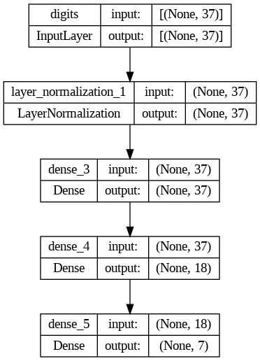

## Решение к кейсу **Координация пропуска вагонопотока**  в рамках хакатона **Цифровой прорыв** 
## Проект
Проект состоит из обученной нейросети и веб-интерфейса, визуализирующего результаты ее работы.

### Описание
#### ML-модель
 \
Так как в обучающий данных отсутвует **label**, который необходимо предсказывать, то мы используем обучение без учителя. А именно **обучение с подкреплением**, где веса в модели корректируеются с помощью **генетического алгоритма**. Генетический алгоритм в каждом поколении ищет модель, показывающую наилучшие результаты, и на основе подборки таких моделей создает более **совершенные**.

#### Серверная часть
Как и ml-модель, серверная часть реализована на **Python**. Представляет собой минимальный сервер на **Flask**, который обрабатыевает данные из датасета (расписание поездов) и отдает клиенту рекомендации по управлениею вагонопотоком.

#### Веб-интерфейс
 \
Реализован на чистом JS + HTML + CSS. Представляет собой минимальную визуализацию сформированного расписания.

### Запуск
```
git clone https://github.com/Atikin-NT/hacks-ai.git
cd hacks-ai
pip install flask, numpy, tensorflow
python .\app.py
```
---

### Юзер стори 1: 
Я, как диспетчер ржд, хочу видеть, какие составы потребуется сформировать из имеющихся и приходящих на конкретную станцию вагонов.

##### Что улучшили: 
Добавили выбор станции и отображение информации о приходящих составах.

---

### Юзер стори 2:
 Я, как работник станции, хочу понимать, где размещать только что отцепленные вагоны и как долго они будут храниться на станции.

##### Что улучшили: 
Добавили отображение информации по отправлению только что отцепленных вагонов. (Время, локомотив, следующую станцию)
